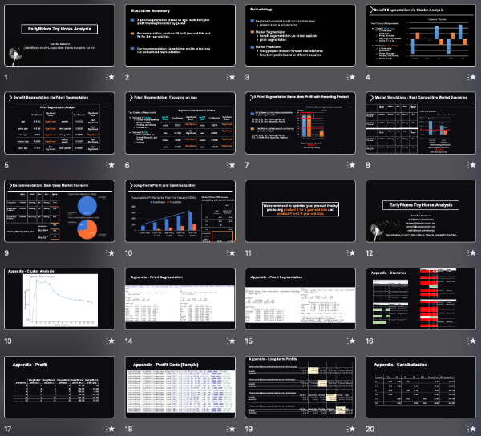
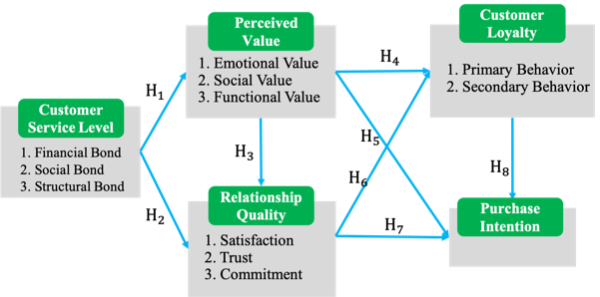
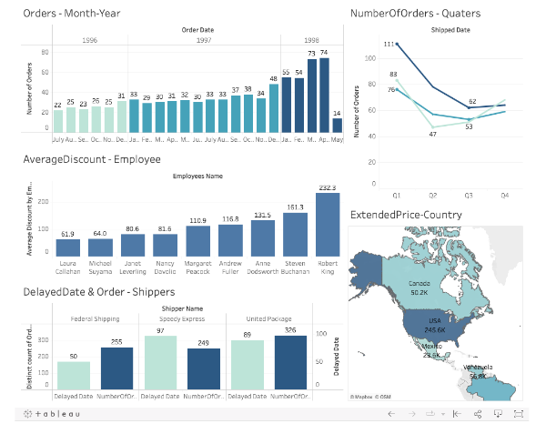

# Welcome to Yun Shen's portfolio!

>I am a self-motivated individual with a passion for marketing analytics. As a continuous learner, I keep learning new R, Python, SQL, and Google Analytics
>skillsets. As a team player, I enjoyed communication and collaboration with diversified teams to translate data into valuable business insights and tell the story
>of data.  

[LinkedIn profile](https://www.linkedin.com/in/yun-shen-carina/)

## Projects
### [New Product Conjoint Analysis for Toy Horse (R & Tableau)](https://rpubs.com/yunshen/874187)

> - Generated product line recommendation to maximize profit through market share simulation for toy horse company.
> - Performed K-Means cluster analysis to divide customers into segmentations for potential unreached segments.
> - Conducted conjoint analysis solving software issue for 4000+ rows of rating data and simulated 40 scenarios of company and competitor’s profits and market share.
> - Visualized and presented profit-maximizing product mix to non-technical clients, increasing market share by 35% and profits by 40.5% while accounting for competitor response and cannibalization.

### [The Impact of Relationship Marketing on Online Bookstores (SPSS, Excel)](https://drive.google.com/file/d/18xAEwumRgFQr19_82c1mIDahJYtrlCKM/view?usp=sharing)

> - Hypothesized causal relationship of relationship marketing on purchase intention through extensive literature reviews.
> - Designed survey and performed factor analysis on survey of 300 respondents to reduce dimensions for 3 mediators, including perceived value, relationship quality, and customer loyalty.
> - Validated hypotheses and built a multi-mediation model through regression analysis.

### [Customer Analysis: Data Warehouse Building and Visualization (SQL & Tableau)](https://public.tableau.com/app/profile/yun.shen.carina/viz/CustomerAnalysis_16477202783490/Dashboard1)

> - Built data warehouse by joining 8 tables and created dashboard using customer data, aggregating data sources for ad-hoc analysis.
> - Queried data warehouse to discover insights of potential managerial challenges and white space opportunities, including over-use of discounts, inefficient shippers, and segmentation of consumers based on spending.  

